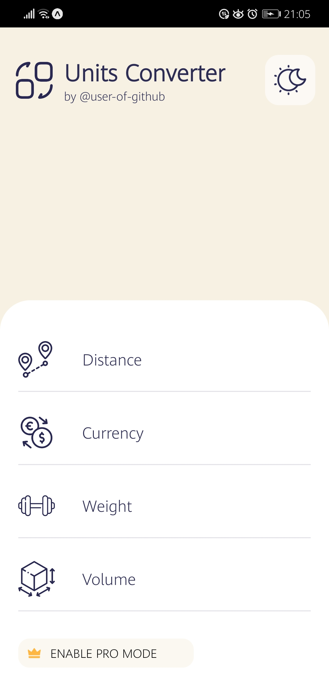
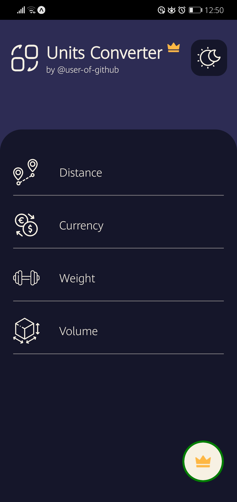
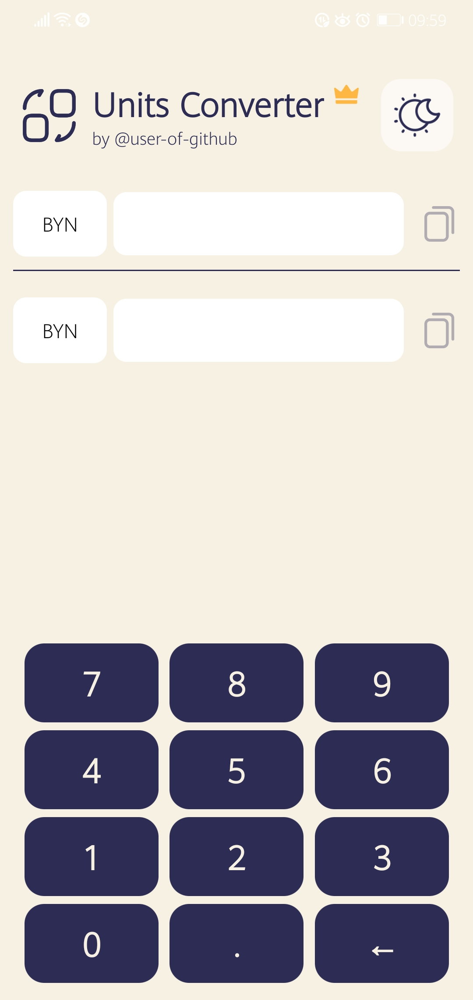
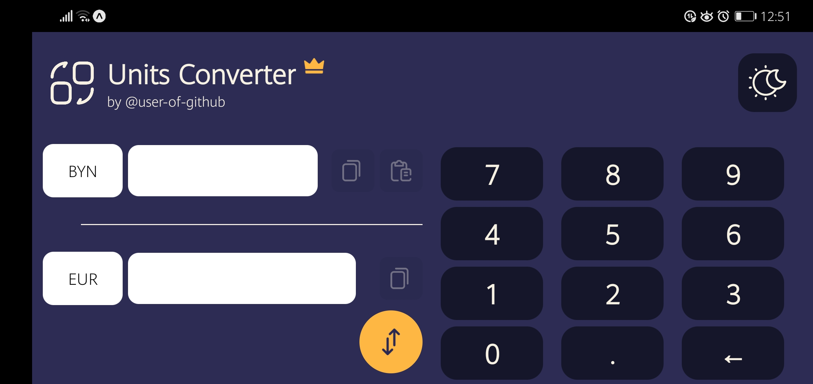

# _Unit Converter_
###### _My first mobile application for Android_  

  

## Demo:  
### Home screen: 

  

### Converter screen (_premium_ mode enabled):   
#### Portrait orientation:

#### Landscape orientation:  

## Features:  
* _Theme switching_  
* _Fully self-stylized components_  
* _Maximum decomposition on independent components_  
* _React performance principles (No uselesee re-render and so on)_
* _Adaptive interface (for portrait and landscape mode)_  
* _Vibration when click to buttons_  
* _Built with Expo EAS_

## Used:  
* _[Android SDK](https://developer.android.com/studio)_
* _[React Native](https://reactnative.dev/)_  
* _[Expo](https://expo.dev/)_
* _[TypeScript](https://www.typescriptlang.org/)_  
* _Additional NPM-packages for development_

## To locally run:  
(You need to have installed: NodeJS, NPM, Android SDK and Expo Go)  
(And also USB DEBUG MODE turned on in settings of your mobile phone)
`yarn`  
`yarn expo start --tunnel`  

&nbsp;  
###### Copyright © 2022, September