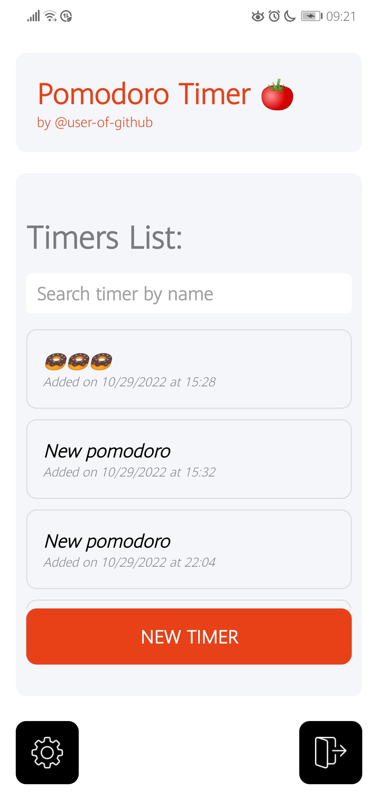
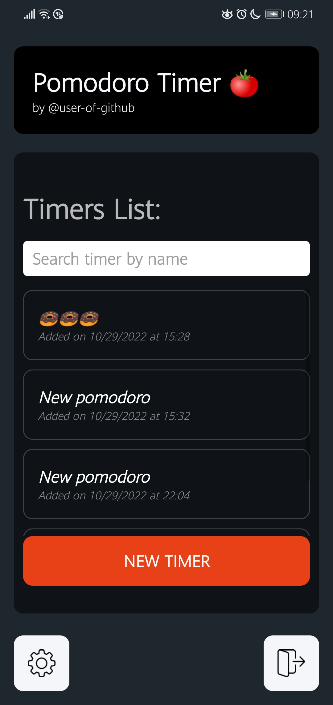
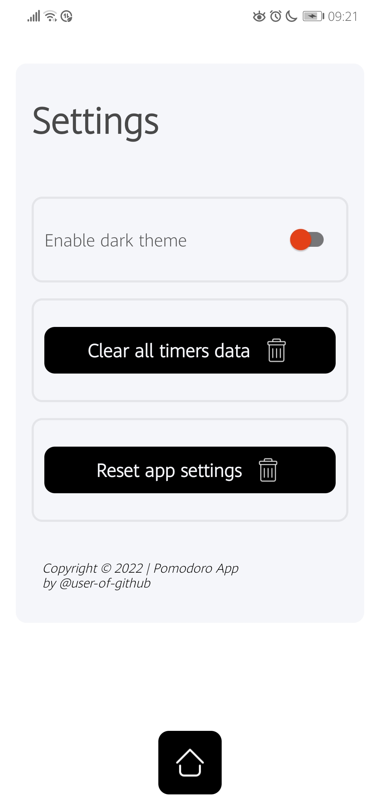
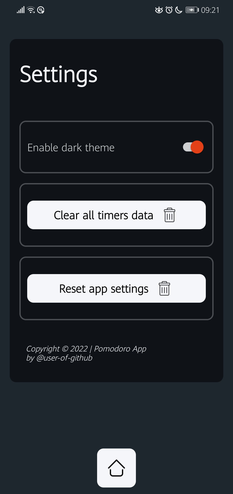
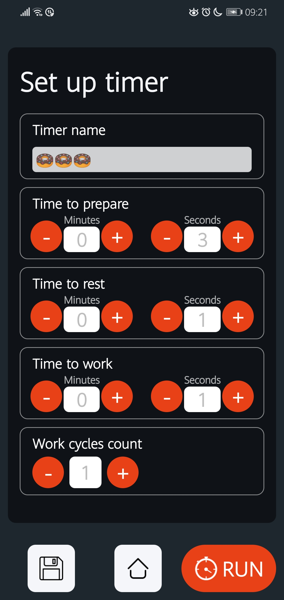

# _Pomodoro App Timer_
###### _Mobile application for Android_  

  

## Demo:  
### Home Screen (Light & Dark theme)

  

&nbsp;  
### Settings Screen (Light & Dark theme)

  

&nbsp;
### Timer Editor Screen (Light & Dark theme)

## Features:  
* _Theme switching_  
* _Storing app state (settings and so on) in permanent MMKV storage_  
* _Advanced mode with additional opportunity_
* _Fully self-stylized components_  
* _Maximum decomposition on independent components_  
* _Perfomance optimizations (via React Memo, React Callback, Redux)_

## Used:  
* _[Android SDK](https://developer.android.com/studio)_
* _[React Native](https://reactnative.dev/)_  
* _[TypeScript](https://www.typescriptlang.org/)_  
* _[Redux Toolkit](https://redux-toolkit.js.org/)_  
* _Additional NPM packages for development_

## To locally run:  
(You need to have installed: NodeJS, NPM, Android SDK, Java JDK)  
(And also _USB DEBUG MODE_ turned on in settings of your mobile phone)  
`yarn`  
`yarn android`  

## To build:  
_[instamobile.io/android-development/generate-react-native-release-build-android](https://instamobile.io/android-development/generate-react-native-release-build-android/)_ 

&nbsp;  
###### Copyright © 2022, October
